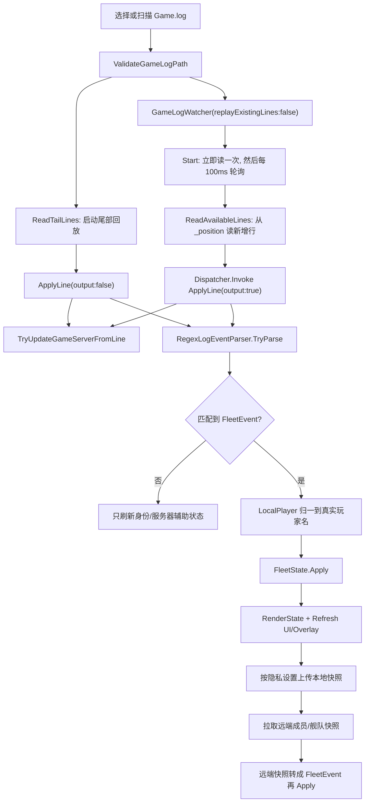

# Game.log 监听算法说明

本文档说明 StarBridge 当前的 `Game.log` 监听、解析和状态推理算法。它覆盖本地日志输入、首次回放、实时追踪、正则事件解析、飞船/地点置信度推理、服务器分线识别、网络状态合并和 UI/Overlay 消费链路。

更新时间：2026-07-07

## 1. 一句话概览

当前算法不是简单地“读到一行日志就覆盖玩家状态”。它采用一条证据流水线：

```text
Game.log 行
  -> 解析成 FleetEvent
  -> 按事件类型给飞船/地点/在线状态增加或清除证据
  -> 用分数和时间衰减计算置信度
  -> 渲染玩家列表、Overlay、个人面板
  -> 按隐私设置上传 NetworkPlayerSnapshot
  -> 拉取远端快照并再次转成 FleetEvent 合并
```

算法的核心目标是：在 Star Citizen 日志并不总是直接告诉我们“玩家当前在哪艘船、在哪个地点”的情况下，用多种弱信号合并出一个尽量稳定、可解释、可衰减的状态。

## 2. 相关源码地图

| 文件 | 职责 |
| --- | --- |
| `StarBridge.Core/LogWatching/GameLogWatcher.cs` | 通用日志追踪器，负责从上次读取位置继续读取新增行。 |
| `StarBridge.Desktop/GameLogInitialReplayReader.cs` | 桌面端启动时读取日志尾部，恢复近期状态。 |
| `StarBridge.Core/Parsing/RegexLogEventParser.cs` | 正则规则表，把原始日志行转成 `FleetEvent`。 |
| `StarBridge.Core/Parsing/ILogEventParser.cs` | 解析器接口。 |
| `StarBridge.Core/Events/FleetEvent.cs` | 事件数据结构，承载玩家、飞船、地点、证据分等字段。 |
| `StarBridge.Core/Events/FleetEventType.cs` | 支持的事件类型枚举。 |
| `StarBridge.Core/State/FleetState.cs` | 状态机和推理算法，维护玩家状态、证据积分、置信度和衰减。 |
| `StarBridge.Core/State/FleetPlayer.cs` | 单个玩家的当前状态和推理元数据。 |
| `StarBridge.Desktop/MainWindow.xaml.cs` | WPF 主程序中的监听启动、`ApplyLine`、渲染、网络同步和服务器分线辅助解析。 |
| `StarBridge.Desktop/LogFileSelectionGuard.cs` | 校验用户选择的日志必须是可读的 `Game.log`。 |
| `StarBridge.Desktop/IdentityInitialization.cs` | 快速扫描默认 `StarCitizen/LIVE/Game.log`，并判断身份初始化是否完成。 |
| `StarBridge.Desktop/Models/NetworkModels.cs` | 网络同步快照模型，例如 `NetworkPlayerSnapshot` 和 `NetworkFleetSnapshot`。 |

## 3. 总体流程



## 4. 日志选择和启动恢复

### 4.1 日志路径校验

桌面端通过 `LogFileSelectionGuard.ValidateGameLogPath` 做前置保护：

1. 路径不能为空。
2. 文件名必须是 `Game.log`。
3. 文件必须存在。
4. 文件必须可以用 `FileShare.ReadWrite | FileShare.Delete` 打开读取。

这保证用户不会误选其他大日志文件，也保证 Star Citizen 正在写日志时应用仍然可以读。

### 4.2 默认日志扫描

`IdentityInitialization.FindDefaultGameLog` 会按固定盘扫描候选路径：

```text
<系统盘>\StarCitizen\LIVE\Game.log
<每个固定磁盘>\StarCitizen\LIVE\Game.log
```

找到多个候选时，按最后修改时间倒序选择最新的一个。这用于“快速扫描 Game.log”。

### 4.3 启动尾部回放

桌面端不在启动时全量读取整份日志，而是读取尾部窗口：

```text
InitialGameLogReplayMaxBytes = 2 MB
InitialGameLogReplayMaxLines = 1500 行
```

`GameLogInitialReplayReader.ReadTailLines` 的策略：

1. 从 `max(0, 文件长度 - maxBytes)` 开始读。
2. 如果不是从文件开头读，则先丢弃第一行，避免从半行中间开始解析。
3. 用固定大小队列保留最后 `maxLines` 行。
4. 返回这些行给 `ApplyLine(output:false)`。

`output:false` 的意思是：用这些历史行恢复状态，但不把每条历史事件都刷到实时输出区，避免启动时刷屏。

### 4.4 实时监听启动

尾部回放完成后，桌面端创建：

```csharp
new GameLogWatcher(logPath, replayExistingLines: false, line =>
{
    Dispatcher.Invoke(() => ApplyLine(line, output: true));
});
```

`replayExistingLines:false` 表示监听器从当前文件末尾开始，只处理之后追加的新行。实时回调切回 WPF Dispatcher，保证 UI 状态更新发生在 UI 线程。

## 5. GameLogWatcher 如何追踪新增行

`GameLogWatcher` 是一个轻量 tailer，核心字段是 `_position`。

### 5.1 初始化

构造时会：

1. 把路径转成绝对路径。
2. 检查路径必须包含目录。
3. 确保目录存在。
4. 如果文件不存在则创建空文件。
5. 根据 `replayExistingLines` 设置初始 `_position`：
   - `true`：从 `0` 开始，回放已有内容。
   - `false`：从当前文件长度开始，只看新增内容。

### 5.2 轮询节奏

`Start()` 会先立即执行一次 `PollLog(null)`，然后启动 `System.Threading.Timer`：

```text
dueTime = 100ms
period  = 100ms
```

也就是大约每 100ms 检查一次文件是否增长。

### 5.3 读取方式

每次轮询时：

1. 如果文件不存在，直接返回。
2. 用 `FileMode.Open`、`FileAccess.Read`、`FileShare.ReadWrite | FileShare.Delete` 打开文件。
3. 如果 `stream.Length < _position`，说明文件被截断或轮换，把 `_position` 重置为 `0`。
4. 如果 `stream.Length == _position`，说明没有新增内容，返回。
5. 把 `stream.Position` 移到 `_position`。
6. 用 `StreamReader.ReadLine()` 逐行读取到 EOF。
7. 每读到一行就调用 `_onLine(line)`。
8. 最后把 `_position` 更新为当前 `stream.Position`。

这套设计的好处是：

1. 不需要 `FileSystemWatcher`，避免某些写入模式下事件丢失或合并。
2. 可以读取仍被游戏进程占用的日志。
3. 可以处理日志被截断后重新写入的情况。

## 6. 单行处理：ApplyLine

桌面端每拿到一行日志都会进入 `MainWindow.ApplyLine`。

处理顺序如下：

1. 更新 `_lastGameLogReadAt`，用于个人面板显示最近读取时间。
2. 调用 `TryUpdateGameServerFromLine`，解析服务器 shard 和区域。这是辅助通道，不进入 `FleetState`。
3. 调用 `_parser.TryParse(line)`，尝试把日志行解析成 `FleetEvent`。
4. 如果解析失败：
   - 刷新个人身份面板。
   - 如果服务器信息发生变化，刷新 Header 并按需输出提示。
   - 结束本行处理。
5. 如果解析成功：
   - 如果事件玩家是 `LocalPlayer` 且已经知道本地玩家名，则替换成真实玩家名。
   - 如果事件是 `PlayerOnline`，更新 `_localPlayer`、`_localPlayerId`，并保存配置。
   - 调用 `_fleetState.Apply(fleetEvent)`。
   - 调用 `RenderState()` 刷新玩家列表、舰队面板、Overlay 等。
   - 实时行 `output:true` 时，把可读事件描述追加到输出区。

关键点：服务器 shard 解析和舰队事件解析是并行消费同一行日志的两条逻辑通道。服务器 shard 不影响飞船/地点推理分数。

## 7. 正则解析器：RegexLogEventParser

`RegexLogEventParser` 使用有序规则表。每条规则包含：

1. 输出事件类型 `FleetEventType`。
2. 一个正则表达式。
3. 可选规则元数据，例如默认地点、地点证据分、是否清空飞船状态。

正则统一使用：

```text
RegexOptions.Compiled
RegexOptions.IgnoreCase
RegexOptions.CultureInvariant
```

### 7.1 先匹配先返回

解析器按 `_rules` 顺序逐条匹配。第一条成功的规则会直接生成 `FleetEvent` 并返回。规则顺序因此很重要，越具体的真实日志模式应该放在更泛化的模式前面。

### 7.2 命名捕获字段

规则主要使用以下命名组：

| 捕获组 | 含义 |
| --- | --- |
| `player` | 玩家名。 |
| `playerId` | 玩家 GEID。 |
| `ship` | 飞船代码或飞船实体名前缀。 |
| `shipId` | 飞船实例 ID。 |
| `location` | 地点代码。 |
| `target` | 导航目标地点。 |
| `combat` | 战斗状态。 |
| `network` | 网络状态。 |

解析成功后会做归一化：

1. `ship` 会调用 `NormalizeShipName`，去掉末尾 `_数字` 形式的实例后缀。
2. 如果规则标记 `PlayerIsShipOwner`，捕获到的 `player` 会放进 `ShipOwner`，事件的 `Player` 改成 `LocalPlayer`。
3. 如果没有捕获到玩家名，默认 `Player = "LocalPlayer"`。
4. 如果没有地点但规则定义了 `DefaultLocation`，使用默认地点。
5. 导航事件会设置 `NavigationTarget`。
6. 每个事件带上 `Timestamp = DateTimeOffset.Now` 和原始 `SourceLine`。

桌面端在事件进入 `FleetState` 前还会调用 `FleetEventShipNormalizer`：

1. 通过 `ShipNameLocalizer.ResolveCode` 把飞船频道里的英文显示名解析成数据库代码。
2. 例如 `Anvil Arrow` 会转成 `ANVL_Arrow`，`Aegis Sabre` 会转成 `AEGS_Sabre`。
3. 驾驶位 token 本身通常已经是代码，因此会原样通过。
4. 这样 `PlayerEnteredShip` 和 `PlayerControllingShip` 最终都会进入同一个“上船”计算路径。

`ShipOwner` 当前主要是为未来扩展和诊断保留，`FleetState` 暂未使用它参与状态计算。

## 8. 当前支持的日志事件类型

### 8.1 身份和在线状态

| 日志模式 | 事件 | 说明 |
| --- | --- | --- |
| `nickname="..." playerGEID ...` | `PlayerOnline` | 识别本地玩家名和玩家 ID。 |
| `PLAYER_OFFLINE player=...` | `PlayerOffline` | 合成/测试格式，用于标记离线。 |

真实桌面端还会每 5 秒检查 Star Citizen 进程，把本地玩家在线状态和游戏进程绑定。也就是说，本地玩家是否在线并不只依赖日志行。

### 8.2 飞船进入/离开

| 日志模式 | 事件 | 证据含义 |
| --- | --- | --- |
| `<SHUDEvent_OnNotification> Added notification "... joined ... channel 'ship : player'"` | `PlayerEnteredShip` | 本地客户端加入飞船频道；频道里的英文飞船名会先反查为数据库代码，然后硬确认当前飞船并建立频道锁定。 |
| `<SHUDEvent_OnNotification> Added notification "... left ... channel 'ship : player'"` | `PlayerExitedShip` | 离开对应飞船频道，若该飞船是当前飞船则清空；若是旧船的迟到事件则忽略。 |
| `PLAYER_ENTER_SHIP player=... ship=...` | `PlayerEnteredShip` | 合成/测试格式。 |
| `PLAYER_EXIT_SHIP player=... ship=...` | `PlayerExitedShip` | 合成/测试格式。 |

`SHUDEvent` 规则会把事件玩家标为 `LocalPlayer`，因为这类日志来自本地客户端视角。

### 8.3 驾驶位/控制令牌

| 日志模式 | 事件 | 证据含义 |
| --- | --- | --- |
| `SetDriver: ... Local client node ... 'ship_id'` | `PlayerControllingShip` | 明确进入驾驶/控制位，是最高权重飞船证据。 |
| `Local client node ... acquiring/taking/received ... control token ... 'ship_id'` | `PlayerControllingShip` | 取得控制令牌，也是高权重飞船证据。 |
| `ClearDriver: ... Local client node ... 'ship_id'` | `PlayerStoppedDrivingShip` | 离开驾驶位。多 crew 船不等于离船；部分单座小型战机视为离开飞船。 |
| `<Failed to get starmap route data!> ... CSCItemNavigation...` | `PlayerShipControlSignal` | 导航系统上下文中的弱飞船证据。 |
| `<Player Requested Fuel to Quantum Target... CSCItemNavigation>` | `PlayerShipControlSignal` | 导航系统上下文中的弱飞船证据。 |
| `<Calculate Route> ... CSCItemNavigation::CalculateRoute` | `PlayerShipControlSignal` | 导航系统上下文中的弱飞船证据。 |

控制令牌类日志通常能证明“本地玩家正在操作某艘具体实例船”。导航系统上下文只能证明“这行日志发生在某艘船的导航组件里”，因此权重更低。

### 8.4 地点和导航

| 日志模式 | 事件 | 地点证据 |
| --- | --- | --- |
| `<RequestLocationInventory> Player[...] requested inventory for Location[...]` | `PlayerLocationChanged` | 分数 95，强地点证据，同时清空飞船状态。 |
| `PLAYER_LOCATION player=... location=...` | `PlayerLocationChanged` | 分数 90，合成/测试格式。 |
| `<Player Selected Quantum Target - Local> ... selected point target ...` | `PlayerNavigationTargetChanged` | 设置导航目标，同时提供飞船上下文。 |
| `<Calculate Route> ... Projected Start Location is location for route to destination target` | `PlayerNavigationTargetChanged` | 设置导航目标，并给出起点地点，起点地点分数 60。 |
| `<Calculate Route> ... route to destination target` | `PlayerNavigationTargetChanged` | 设置导航目标，并提供飞船上下文。 |
| `<Calculate Route> ... Successfully calculated route to target` | `PlayerNavigationTargetChanged` | 设置导航目标，并提供飞船上下文。 |
| `<Quantum Drive Arrived - Arrived at Final Destination> ... OnQuantumDriveArrived` | `PlayerLocationChanged` | 默认地点为占位符 `Arrived - awaiting location confirmation`，分数 45。 |

量子抵达事件本身没有直接地点名，所以状态机会结合之前保存的 `NavigationTarget`。如果有已知导航目标，抵达事件会把地点替换为该目标，并把地点分数提升到至少 85。

### 8.5 战斗和网络状态

| 日志模式 | 事件 | 说明 |
| --- | --- | --- |
| `COMBAT_STATE player=... state=...` | `CombatStateChanged` | 更新玩家战斗状态。 |
| `NETWORK_STATE player=... state=...` | `NetworkStateChanged` | 更新玩家网络状态。 |

这两类目前更多是原型/测试输入，真实 Game.log 规则里核心使用的是身份、飞船、地点和导航。

## 9. FleetEvent 数据结构

`FleetEvent` 是解析层和状态层之间的唯一事件合同。主要字段包括：

| 字段 | 用途 |
| --- | --- |
| `Type` | 事件类型。 |
| `Player` | 事件归属玩家。 |
| `Ship` | 解析到的飞船。 |
| `Location` | 解析到的地点或地点占位符。 |
| `CombatState` | 战斗状态。 |
| `NetworkState` | 网络状态。 |
| `Timestamp` | 事件时间，默认解析时的本地时间。 |
| `SourceLine` | 原始日志行，便于诊断。 |
| `PlayerId` | 玩家 GEID。 |
| `ShipOwner` | SHUD channel 中捕获到的飞船拥有者。 |
| `ShipInstanceId` | 飞船实例 ID，用于识别是否还是同一艘实例船。 |
| `NavigationTarget` | 当前量子导航目标。 |
| `LocationEvidenceScore` | 本事件提供的地点证据分。 |
| `LocationEvidence` | 地点证据来源说明。 |
| `ClearsShipState` | 本事件是否应该清空飞船推理。 |

这个设计把“日志正则如何匹配”和“状态机如何推理”分开。解析层只负责尽量提取事实和证据权重，状态层负责解释这些证据。

## 10. FleetState 状态机

`FleetState` 用一个大小写不敏感的字典维护玩家：

```text
Dictionary<string, FleetPlayer> _players
```

每个 `FleetPlayer` 保存：

1. 当前飞船、飞船置信度、飞船证据分、飞船实例 ID。
2. 当前地点、地点置信度、地点证据分。
3. 上次飞船/地点证据时间。
4. 上次已知飞船/地点，用于重连后的低置信度恢复。
5. 在线、战斗、网络和导航目标状态。

每次 `Apply(FleetEvent)` 都会：

1. 找到或创建玩家。
2. 设置 `LastSeen = event.Timestamp`。
3. 设置 `IsIdle = false`。
4. 按事件类型进入不同分支。

## 11. 在线/离线状态处理

### 11.1 PlayerOnline

`PlayerOnline` 会：

1. 设置 `Online = true`。
2. 调用 `RestoreLowConfidenceState`。

如果玩家离线前有 `LastKnownShip` 或 `LastKnownLocation`，重连时会以低置信度恢复：

```text
ShipInferenceScore = 15
ShipConfidence = Low
LocationInferenceScore = 15
LocationConfidence = Low
Evidence = Restored after reconnect
```

这能避免玩家刚重连时 UI 完全空白，但也明确告诉用户这是弱证据。

### 11.2 PlayerOffline

`PlayerOffline` 会：

1. 设置 `Online = false`。
2. 如果当前有已知飞船，保存到 `LastKnownShip`。
3. 如果当前有已知地点，保存到 `LastKnownLocation`。
4. 清空当前飞船和地点推理。
5. 清空导航目标。

本地玩家还会被桌面端的游戏进程检测影响：如果 5 秒定时器发现 Star Citizen 进程退出，会给本地玩家应用一个离线事件。

## 12. 飞船推理算法

飞船推理使用分数模型，最大 100 分。

### 12.1 飞船证据常量

| 常量 | 值 | 含义 |
| --- | --- | --- |
| `MaxShipInferenceScore` | 100 | 飞船证据最高分。 |
| `ShipSignalRefreshBonus` | 25 | 5 分钟内再次看到同一实例船时的刷新奖励。 |
| `ShipEvidenceDecayWindow` | 5 分钟 | 判断同一实例船信号是否新鲜的窗口。 |
| `ShipScoreDecayPerMinute` | 每分钟 8 分 | 常规飞船证据衰减速度。 |
| `PostControlSeatExitDecayPerMinute` | 每分钟额外 10 分 | 离开驾驶位后的额外衰减。 |

### 12.2 飞船事件基础分

| 事件 | 分数 | 证据说明 |
| --- | ---: | --- |
| `PlayerEnteredShip` | 100 | `Ship channel joined`，并建立频道锁定 |
| `PlayerControllingShip` | 90 | `Vehicle control token` |
| `PlayerShipControlSignal` | 35 | `Navigation system context` |
| `PlayerStoppedDrivingShip` | 20 或清空 | 多 crew 船为 `Left control seat; ship not confirmed left`；部分单座战机为 `Single-seat control token released` 并清空 |
| `PlayerNavigationTargetChanged` | 45 | `Quantum route context` |
| `PlayerExitedShip` | 清空当前匹配飞船 | `Ship channel left`；如果离开的是旧船，不清空当前船 |
| `PlayerLocationChanged` 且 `ClearsShipState = true` | 清空 | `Location inventory context` |
| `PlayerOffline` | 清空 | `Player offline` |

### 12.3 加分流程

`AddShipEvidence` 的流程：

1. 先按当前时间调用 `DecayShipInference`，把旧分数衰减到现在。
2. 判断这次证据是否指向不同飞船或不同实例 ID。
3. 如果当前飞船来自频道锁定，弱证据和控制上下文不能替换它；只有新的频道进入、对应频道离开、离线或明确清船事件可以打破。
4. 如果是不同船或不同实例，且允许替换，当前飞船分数清零，并清除 `LastControlSeatLeftAt` 和频道锁定。
5. 判断是否在 5 分钟内再次看到同一 `ShipInstanceId`。
6. 更新 `Ship`、`ShipInstanceId`、`LastShipInstanceSeenAt`。
7. 如果这是飞船频道加入事件，设置 `ShipChannelMembershipConfirmed = true`，分数固定为 100。
8. 如果仍然没有有效飞船名，直接返回。
9. 新分数：

```text
ShipInferenceScore =
    min(100, 当前分数 + 事件基础分 + 同实例刷新奖励)
```

8. 根据新分数刷新 `ShipConfidence`。
9. 记录证据文本和证据时间。

### 12.4 飞船置信度阈值

| 分数区间 | 置信度 | UI 含义 |
| ---: | --- | --- |
| `>= 80` | `High` | 基本确认。 |
| `45 - 79` | `Medium` | 较可信，但可能需要后续确认。 |
| `15 - 44` | `Low` | 弱证据，UI 通常显示“可能在”。 |
| `< 15` | `None` | 证据过期，飞船变成 `Unknown`。 |

### 12.5 飞船衰减和频道锁定

每次 `RenderState()` 都会调用：

```text
_fleetState.RefreshShipInferences(DateTimeOffset.Now)
```

这个方法会遍历所有玩家，对飞船和地点分别衰减。

如果当前飞船来自飞船频道加入事件，`ShipChannelMembershipConfirmed = true`。这种状态不按普通飞船证据衰减，置信度保持 `High`，直到出现以下事件之一：

1. 同玩家进入另一艘飞船频道。
2. 离开当前飞船频道。
3. 玩家离线或游戏进程退出。
4. 强地点上下文要求清空飞船状态，例如地点 inventory。
5. 当前飞船属于单座小型战机且释放驾驶控制 token。

飞船衰减公式：

```text
elapsedMinutes = now - LastShipScoreUpdatedAt
decayPerMinute = 8 + (LastControlSeatLeftAt != null ? 10 : 0)
ShipInferenceScore = max(0, ShipInferenceScore - floor(elapsedMinutes * decayPerMinute))
```

对于没有频道锁定的飞船，如果玩家离开驾驶位已经超过 5 分钟，并且这 5 分钟内没有再次看到同一实例船信号，算法会把飞船分数压到低置信区间：

```text
ShipInferenceScore = min(ShipInferenceScore, 44)
ShipInferenceScore = max(ShipInferenceScore, 15)
```

这样做的意图是：对多 crew 船，离开驾驶位不等于离开飞船，所以不能立刻清空；但长时间没有同实例信号，也不能继续保持中高置信。对配置在单座战机规则里的船，`ClearDriver` 会直接清空飞船。

## 13. 地点推理算法

地点推理也使用最大 100 分的证据模型，但衰减更慢。

### 13.1 地点证据常量

| 常量 | 值 | 含义 |
| --- | --- | --- |
| `MaxLocationInferenceScore` | 100 | 地点证据最高分。 |
| `LocationScoreDecayPerMinute` | 每分钟 4 分 | 地点证据衰减速度。 |

### 13.2 地点事件基础分

| 来源 | 分数 | 证据说明 |
| --- | ---: | --- |
| `RequestLocationInventory` | 95 | `Location inventory context` |
| `PLAYER_LOCATION` | 90 | `Explicit player location` |
| `Calculate Route` 起点地点 | 60 | `Quantum route start location` |
| `Quantum Drive Arrived` 无目标辅助时 | 45 | `Quantum arrival` |
| `Quantum Drive Arrived` 有导航目标时 | 至少 85 | `Quantum arrival target` |
| 远端成员 High | 85 | `Fleet member sync` 或 `Network relay` |
| 远端成员 Medium | 55 | `Fleet member sync` 或 `Network relay` |
| 远端成员 Low | 20 | `Fleet member sync` 或 `Network relay` |
| 远端成员未知置信度 | 15 | `Fleet member sync` 或 `Network relay` |

### 13.3 加分流程

`AddLocationEvidence` 的流程：

1. 如果地点为空或分数小于等于 0，忽略。
2. 先调用 `DecayLocationInference`，把旧地点分数衰减到当前时间。
3. 如果新地点和当前地点不同，地点分数清零。
4. 设置 `Location = location`。
5. 新分数：

```text
LocationInferenceScore = min(100, 当前分数 + 事件分数)
```

6. 根据分数刷新地点置信度。
7. 记录地点证据文本和时间。

### 13.4 地点置信度阈值

地点置信度阈值和飞船相同：

| 分数区间 | 置信度 | UI 含义 |
| ---: | --- | --- |
| `>= 80` | `High` | 地点基本确认。 |
| `45 - 79` | `Medium` | 可能在该地点。 |
| `15 - 44` | `Low` | 可能已经离开该地点。 |
| `< 15` | `None` | 地点变成 `Unknown`。 |

### 13.5 地点衰减

地点衰减公式：

```text
elapsedMinutes = now - LastLocationScoreUpdatedAt
LocationInferenceScore =
    max(0, LocationInferenceScore - floor(elapsedMinutes * 4))
```

地点比飞船衰减慢，因为地点本身变化通常少于飞船控制上下文变化。

## 14. 导航目标和量子抵达

导航目标是地点推理中的关键辅助状态。

### 14.1 设置导航目标

当解析到 `PlayerNavigationTargetChanged`：

1. `player.NavigationTarget = fleetEvent.NavigationTarget`。
2. 如果事件里带有起点地点，并且玩家当前地点未知或等于该起点，则给这个起点地点加分。
3. 用路线日志中的飞船上下文给飞船加 45 分。

### 14.2 抵达目标

当解析到量子抵达日志时，解析器只能给出占位地点：

```text
Arrived - awaiting location confirmation
```

状态机随后判断：

1. 如果玩家有已知 `NavigationTarget`，把地点替换为该目标。
2. 把地点分数提升到至少 85。
3. 证据改成 `Quantum arrival target`。
4. 抵达处理完成后，把 `NavigationTarget` 重置为 `None`。

因此，算法不是单靠“抵达”日志识别地点，而是用“先前设置的目标 + 抵达事件”组合推断当前位置。

## 15. 服务器分线辅助解析

服务器分线不进入 `FleetState`，但同样从 `Game.log` 行解析。

### 15.1 匹配规则

桌面端支持三类 shard 识别：

| 正则 | 示例语义 |
| --- | --- |
| `JoinPuShardRegex` | `<Join PU> ... shard[...]` |
| `UpdateShardIdRegex` | `<Update Shard Id> New Shard Id: ...` |
| `GenericGameServerShardRegex` | 包含 `pub_...` 且附近有 `shard/server/hub` 字样。 |

同时支持两类退出/清空：

| 正则 | 语义 |
| --- | --- |
| `GameServerDisconnectRegex` | SC 默认规则下的玩家主动断开或远端断开。 |
| `GameServerReturnedToFrontendRegex` | 返回前端，且之前已有服务器信息时清空。 |

### 15.2 区域映射

`MapGameServerRegion` 通过 shard 字符串包含关系映射区域：

| shard 片段 | 区域 |
| --- | --- |
| `use`, `usw`, `_us`, `pub_us` | 美服 |
| `eu` | 欧服 |
| `aus`, `_au`, `oce` | 澳服 |
| `asia`, `apse`, `_ap`, `sg`, `jp`, `hk` | 亚服 |
| 其他 | 未知 |

### 15.3 启动后回扫

实时监听启动后，桌面端还会异步执行一次 `RefreshGameServerFromLogSnapshotAfterStartAsync`：

1. 如果游戏进程未运行，服务器信息保持隐藏或清空。
2. 如果游戏进程运行，则从当前 `Game.log` 全量扫描最近一次 shard 或 logout 记录。
3. 如果最近是 logout，则清空服务器信息。
4. 如果最近是 shard，则更新 `_gameServerShard`、`_gameServerRegion`、`_gameServerObservedAtUtc`。

这条回扫只负责服务器信息，不改变飞船/地点证据。

## 16. UI 渲染如何消费状态

`RenderState()` 是状态到界面的主要出口：

1. 如果已有本地玩家名，用 `_isGameProcessRunning` 修正本地玩家在线状态。
2. 调用 `_fleetState.RefreshShipInferences(now)`，触发飞船和地点衰减。
3. 遍历 `_fleetState.Players` 生成 `PlayerRow`。
4. 对非本地玩家，如果存在 `_networkSnapshots`，用远端快照覆盖显示用的飞船、地点和置信度。
5. 飞船名先通过 `ShipNameLocalizer.ResolveCode` 统一成数据库代码，再通过 `ShipNameLocalizer.DisplayName` 本地化。
6. 地点通过 `LocationNameLocalizer` 本地化。
7. 刷新成员列表、舰队 Header、小队、Overlay 和右侧面板。

UI 文案会根据置信度变化：

| 状态 | UI 倾向 |
| --- | --- |
| 飞船 High/Medium | `飞船：...` |
| 飞船 Low | `可能在：...` |
| 地点 High | `地点：...` |
| 地点 Medium | `可能在：...` |
| 地点 Low | `可能离开：...` |
| None/Unknown | 显示未知。 |

## 17. 网络同步如何接入同一算法

本地状态上传和远端状态合并也复用同一套推理模型。

### 17.1 本地上传

`PushLocalSnapshotAsync` 会从当前本地 `PlayerRow` 构造 `NetworkPlayerSnapshot`，字段包括：

1. 玩家名和 callsign。
2. 舰队名和小队名。
3. 是否在线。
4. 原始飞船和飞船置信度。
5. 原始地点和地点置信度。
6. 更新时间。
7. 头像、机库共享状态和可见性范围。

上传前会应用隐私设置：

1. 私密范围不上传共享状态。
2. 游戏未运行时可隐藏在线状态。
3. 可分别关闭在线、飞船、地点同步。
4. 可隐藏低置信地点。
5. 可按设置移除服务器信息。

### 17.2 远端成员快照合并

远端 `NetworkPlayerSnapshot` 进入 `ApplyNetworkSnapshot`：

1. 忽略空玩家名和本地玩家自己的远端回声。
2. 如果当前未加入舰队，移除该网络快照。
3. 记录成员加入/离开/离线等舰队事件日志。
4. 如果玩家不属于当前舰队，停止应用到状态机。
5. 先用 `PlayerOnline` 或 `PlayerOffline` 更新在线状态。
6. 如果远端有飞船，用 `PlayerShipControlSignal` 写入低权重飞船证据。
7. 如果远端有地点，用 `PlayerLocationChanged` 写入地点证据，分数由远端置信度转换。

也就是说，远端状态不是直接覆盖 `FleetState` 的所有字段，而是转换为事件后进入状态机。这样本地日志、远端同步和舰队成员快照最终都走同一套证据衰减逻辑。

### 17.3 舰队目录快照

`NetworkFleetSnapshot` 中的成员列表也会经 `ApplyFleetMemberSnapshotToState` 转成事件：

1. 成员在线状态转成 `PlayerOnline` 或 `PlayerOffline`。
2. 成员飞船转成 `PlayerShipControlSignal`。
3. 成员地点转成 `PlayerLocationChanged`。

这样从舰队目录拉回来的成员状态，也能被本地推理模型吸收。

## 18. 本地缓存和恢复

桌面配置 `DesktopAppConfig` 保存：

1. `LogPath`
2. `PlayerName`
3. `PlayerId`
4. 账号、网络、Overlay 配置
5. `FleetStateJson`

`FleetStateJson` 主要缓存舰队资料、小队、任务、行动计划、事件日志、权限等业务状态。注意：当前核心的 `FleetState` 玩家推理分数本身没有完整序列化进这个 JSON，启动时玩家实时状态主要依赖：

1. `Game.log` 尾部回放。
2. 网络快照拉取。
3. 游戏进程检测。
4. 已保存的玩家名和玩家 ID。

这也是为什么启动尾部回放很重要，它负责恢复最近的飞船和地点证据。

## 19. 算法示例

### 19.1 进入飞船

日志：

```text
<SHUDEvent_OnNotification> Added notification "... joined ... channel 'AEGS_Sabre : PlayerA'"
```

解析：

```text
Type = PlayerEnteredShip
Player = LocalPlayer
Ship = AEGS_Sabre
ShipOwner = PlayerA
```

桌面端如果已知本地玩家名为 `PlayerA`，会把 `LocalPlayer` 替换为 `PlayerA`。

状态变化：

```text
Ship = AEGS_Sabre
ShipInferenceScore = 100
ShipConfidence = High
Evidence = Ship channel joined
Online = true
ShipChannelMembershipConfirmed = true
```

### 19.2 进入驾驶位

日志：

```text
SetDriver: ... Local client node ... 'AEGS_Sabre_123456'
```

解析：

```text
Type = PlayerControllingShip
Player = LocalPlayer
Ship = AEGS_Sabre
ShipInstanceId = 123456
```

状态变化：

```text
ShipInferenceScore += 90
ShipInstanceId = 123456
LastControlSeatLeftAt = null
ShipConfidence = High
Evidence = Vehicle control token
```

如果 5 分钟内再次看到同一 `ShipInstanceId`，额外加 25 分刷新奖励。

### 19.3 离开驾驶位但未离船

日志：

```text
ClearDriver: ... Local client node ... 'AEGS_Sabre_123456'
```

状态变化：

```text
ShipInferenceScore += 20
LastControlSeatLeftAt = now
Evidence = Left control seat; ship not confirmed left
```

这是多 crew 船或未配置为单座战机时的行为。之后每分钟会按 `8 + 10 = 18` 分衰减。超过 5 分钟且没有再看到同一实例船信号时，分数会被压到低置信区间，但不会立刻清空飞船。

如果当前船命中单座小型战机规则，例如 `ANVL_Arrow`，同样的 `ClearDriver` 会直接清空飞船：

```text
Ship = Unknown
ShipConfidence = None
Evidence = Single-seat control token released
```

### 19.4 设置导航并抵达

先出现路线日志：

```text
<Calculate Route> ... Projected Start Location is MIC_L1 for route to destination ARC_L1
```

状态变化：

```text
NavigationTarget = ARC_L1
Location = MIC_L1
LocationInferenceScore += 60
ShipInferenceScore += 45
```

随后出现抵达日志：

```text
<Quantum Drive Arrived - Arrived at Final Destination> ... OnQuantumDriveArrived
```

状态机发现有 `NavigationTarget = ARC_L1`，于是：

```text
Location = ARC_L1
LocationInferenceScore = max(current + score, 至少 85)
LocationConfidence = High
NavigationTarget = None
```

## 20. 当前边界和注意点

1. `GameLogWatcher` 使用 100ms 轮询，没有重入锁。正常日志量下问题不大；如果 `_onLine` 长时间阻塞，理论上可能出现定时器重入风险。桌面端回调会投递到 UI 线程，但读取器本身仍由 `System.Threading.Timer` 驱动。
2. `GameLogWatcher` 捕获并吞掉读取异常，应用不会因为临时文件占用崩溃，但诊断信息也会丢失。后续如果要排查用户机器上的日志读取问题，可以增加可选诊断日志。
3. 启动时先尾部回放，再创建实时 watcher。两者之间极短窗口内追加的日志，当前实现可能不会被回放到。通常影响很小，但如果要做到严格无丢行，需要把 watcher 的初始位置和回放窗口统一设计。
4. `StreamReader.ReadLine()` 在 EOF 遇到未换行的半行时也可能返回内容。当前算法假设 Game.log 按完整行写入。若未来遇到半行日志，可在 watcher 中缓存未终止行。
5. 正则解析是“先匹配先返回”。新增规则时要注意顺序，避免泛化规则抢先匹配具体规则。
6. `ShipOwner` 已被事件模型保留，但状态机暂未使用。后续如果要识别“本地玩家正在某个玩家拥有的船上”，可以把该字段接入 UI 或成员关系逻辑。
7. 飞船和地点分数是经验权重，不是概率。`High/Medium/Low` 是可解释等级，不应理解为严格统计置信度。
8. 远端快照进入 `FleetState` 时会被转换为低/中权重证据；非本地玩家的显示层还会直接使用 `_networkSnapshots` 覆盖展示字段，所以状态机和 UI 展示之间存在一层显示优先级。
9. `Game.log` 中不同版本 Star Citizen 的文本格式可能变化，解析规则需要持续用真实样本校准。
10. 单座小型战机的 `ClearDriver` 清船规则目前用保守的船名 token 表实现，后续应根据真实样本继续增删。

## 21. 调试入口

排查日志监听问题时建议按这个顺序看：

1. `LogPathBox` 和个人面板中的最近读取时间，确认 watcher 是否在读行。
2. `MainWindow.ApplyLine`，确认行是否进入服务器辅助解析和事件解析。
3. `RegexLogEventParser.TryParse`，确认是否命中规则。
4. `FleetState.Apply`，确认事件是否正确改变玩家状态。
5. `FleetState.RefreshShipInferences`，确认是否被衰减清空。
6. `RenderState`，确认状态是否被 UI/Overlay 显示层覆盖。
7. `PushLocalSnapshotAsync` 和 `ApplyNetworkSnapshot`，确认网络同步是否按隐私设置发布或合并状态。

正则和状态机行为应通过 `StarBridge.Core.Tests` 与 `StarBridge.Desktop.Tests` 中的回归用例验证，避免维护与正式应用行为分离的调试入口。

## 22. 设计意图总结

当前 Game.log 监听算法的重点是稳健性和可解释性：

1. 读取层尽量不中断，不依赖文件系统事件。
2. 解析层把真实日志和测试格式统一成 `FleetEvent`。
3. 状态层用证据分、置信度和衰减表达“不确定但有依据”的状态。
4. UI 层把低置信状态明确展示成“可能在/可能离开”，避免假装完全确定。
5. 网络层复用同一事件模型，让本地和远端成员状态可以在同一个推理系统里合并。

这套算法适合 Star Citizen 日志这种信号稀疏、格式多变、很多状态只能侧面推断的场景。
